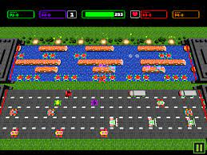
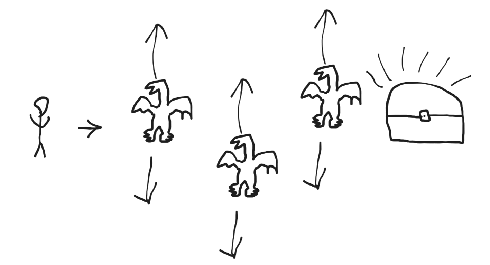

# Pixel-Collision

## Game Concept 

Casual 2D "Frogger' Style, where the player controls a Demi-god who needs to reach a treasure and avoid dragons

## Target Platforms

    * Cross-platform: desktop and mobile
    * Browser game

## UI/ Player controls
    * Mouse click/ touch screen
    * When the player clicks/ touches the screen, the character moves forward.

## Game mechanics

    * Drakes moving up and down(bouncing movement)
    * If the player is hit by a drake, the game will restart.
    * If the player moves to a treasure, the players wins.
    * Player moves in one direction. 

## Assets

    * Style: Pixel Art, 8-bit style.
    * Sprites:
        * Background:
        * Player:
        * Enemy:
        *Treasure:

